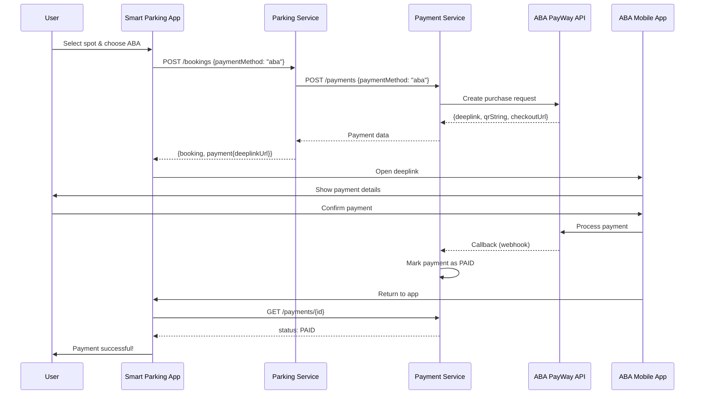
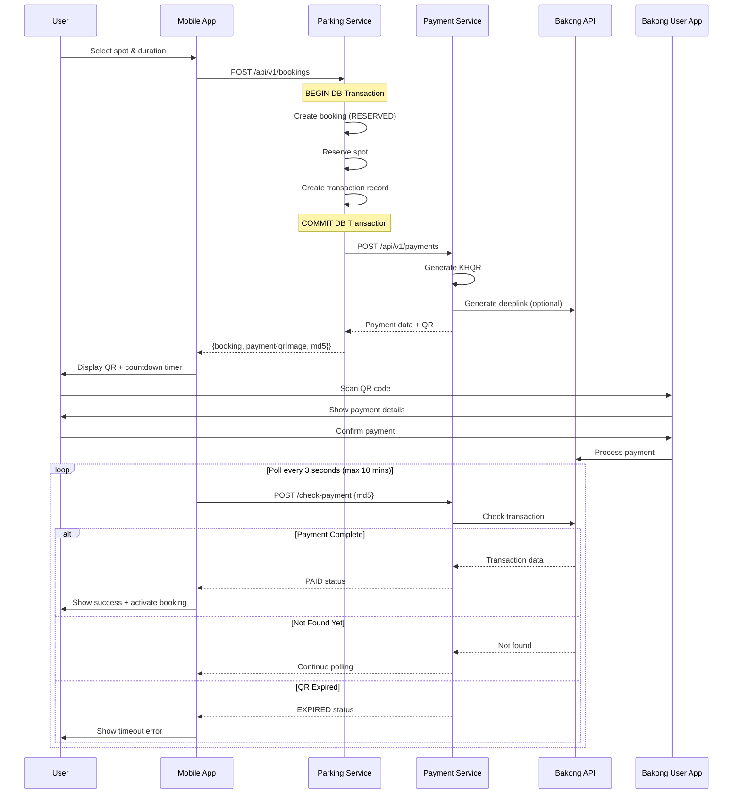

# KHQR Payment API Documentation for Frontend

## 🔄 What Changed

The booking and payment flow has been optimized to follow KHQR best practices:

### Key Changes
- ✅ **Removed wasteful QR generation** - No more temporary booking QR
- ✅ **Database transactions** - Atomic booking creation with automatic rollback
- ✅ **Clearer response structure** - Payment data separated from booking
- ✅ **Optimized flow** - QR only generated once, from payment service

---

## 📱 API Endpoints

### 1. Create Booking with Payment

**Endpoint:** `POST /api/v1/bookings`

**Description:** Creates a parking booking and initiates KHQR payment in a single atomic operation.

#### Request Headers
```http
Authorization: Bearer <access_token>
Content-Type: application/json
```

#### Request Body
```json
{
  "spotId": "uuid-of-parking-spot",
  "durationHours": 2,
  "paymentMethod": "khqr",     // Options: "khqr", "aba", "cash"
  "currency": "KHR"             // Options: "USD", "KHR"
}
```

**OR** with specific start/end time:
```json
{
  "spotId": "uuid-of-parking-spot",
  "startTime": "2025-12-12T14:00:00Z",
  "endTime": "2025-12-12T16:00:00Z",
  "paymentMethod": "khqr",
  "currency": "KHR"
}
```

**Payment Methods:**
- **`"khqr"`** - Bakong QR payment (scan QR with any bank app)
- **`"aba"`** - ABA PayWay (opens ABA app directly via deeplink)
- **`"cash"`** - Cash payment at location

#### Request Parameters

| Field | Type | Required | Description |
|-------|------|----------|-------------|
| `spotId` | string (UUID) | ✅ Yes | ID of the parking spot to book |
| `durationHours` | number | Conditional | Duration in hours (required if no start/end time) |
| `startTime` | string (ISO 8601) | Conditional | Booking start datetime (with endTime) |
| `endTime` | string (ISO 8601) | Conditional | Booking end datetime (with startTime) |
| `paymentMethod` | string | No | Payment method: `"khqr"`, `"aba"`, `"cash"` (default: `"khqr"`) |
| `currency` | string | No | Currency: `"USD"` or `"KHR"` (default: `"KHR"`) |

#### Success Response (201 Created)

```json
{
  "success": true,
  "message": "Booking created successfully",
  "data": {
    "booking": {
      "id": "550e8400-e29b-41d4-a716-446655440000",
      "userId": "660e8400-e29b-41d4-a716-446655440001",
      "spotId": "770e8400-e29b-41d4-a716-446655440002",
      "durationHours": 2,
      "totalPrice": 5.00,
      "status": "RESERVED",
      "createdAt": "2025-12-12T14:30:00.000Z"
    },
    "payment": {
      "paymentId": "880e8400-e29b-41d4-a716-446655440003",
      "qrImage": "data:image/png;base64,iVBORw0KGgoAAAANSUhEUgAA...",
      "qrString": "00020101021229370010kh.gov.nbc.bakong0113...",
      "md5": "5d41402abc4b2a76b9719d911017c592",
      "deeplinkUrl": "https://bakong.page.link/abc123",
      "amount": 20500,
      "currency": "KHR",
      "status": "PENDING",
      "createdAt": "2025-12-12T14:30:01.000Z"
    }
  }
}
```

#### Response Fields

**Booking Object:**
| Field | Type | Description |
|-------|------|-------------|
| `id` | string (UUID) | Unique booking identifier |
| `userId` | string (UUID) | User who created the booking |
| `spotId` | string (UUID) | Parking spot being booked |
| `durationHours` | number | Duration of booking in hours |
| `totalPrice` | number | Total price in USD |
| `status` | string | Booking status: `"RESERVED"`, `"ACTIVE"`, `"COMPLETED"`, `"CANCELLED"` |
| `createdAt` | string (ISO 8601) | When booking was created |

**Payment Object:**
| Field | Type | Description |
|-------|------|-------------|
| `paymentId` | string (UUID) | Unique payment identifier |
| `qrImage` | string | **📱 DISPLAY THIS** - Base64 encoded QR code image |
| `qrString` | string | Raw KHQR string (for advanced use) |
| `md5` | string | **📱 USE FOR POLLING** - MD5 hash for payment verification |
| `deeplinkUrl` | string or null | Bakong deeplink URL (may be null if generation failed) |
| `amount` | number | Payment amount (in currency) |
| `currency` | string | Payment currency: `"USD"` or `"KHR"` |
| `status` | string | Payment status: `"PENDING"`, `"PAID"`, `"FAILED"`, `"EXPIRED"` |
| `createdAt` | string (ISO 8601) | When payment was initiated |

---

### 2. Check Payment Status

**Endpoint:** `POST /api/v1/payments/check-payment`

**Description:** Polls for payment status using MD5 hash. Call this repeatedly every 3-5 seconds while waiting for payment.

#### Request Headers
```http
Authorization: Bearer <access_token>
Content-Type: application/json
```

#### Request Body
```json
{
  "md5": "5d41402abc4b2a76b9719d911017c592"
}
```

#### Request Parameters

| Field | Type | Required | Description |
|-------|------|----------|-------------|
| `md5` | string | ✅ Yes | MD5 hash from payment creation response |

#### Success Response (200 OK)

**When payment is completed:**
```json
{
  "success": true,
  "message": "Payment verified successfully",
  "data": {
    "paymentId": "880e8400-e29b-41d4-a716-446655440003",
    "status": "PAID",
    "transactionData": {
      "hash": "8465d722d7d5065f2886f0a474a4d34dc6a7855355b611836f7b6111228893e9",
      "fromAccountId": "user@acleda",
      "toAccountId": "merchant@wing",
      "currency": "KHR",
      "amount": 20500,
      "description": "Payment for booking 550e8400-e29b-41d4-a716-446655440000"
    },
    "verifiedAt": "2025-12-12T14:32:15.000Z"
  }
}
```

#### Error Response (400 Bad Request)

**When payment not completed yet:**
```json
{
  "success": false,
  "error": "Transaction not found"
}
```

**When payment QR expired:**
```json
{
  "success": false,
  "error": "Payment QR code has expired"
}
```

---

### 3. Get Active Booking

**Endpoint:** `GET /api/v1/bookings/active`

**Description:** Retrieves the user's currently active booking (if any).

#### Request Headers
```http
Authorization: Bearer <access_token>
```

#### Success Response (200 OK)

```json
{
  "success": true,
  "message": "Active booking retrieved successfully",
  "data": {
    "booking": {
      "id": "550e8400-e29b-41d4-a716-446655440000",
      "userId": "660e8400-e29b-41d4-a716-446655440001",
      "spotId": "770e8400-e29b-41d4-a716-446655440002",
      "durationHours": 2,
      "totalPrice": 5.00,
      "status": "ACTIVE",
      "createdAt": "2025-12-12T14:30:00.000Z",
      "parkingSpot": {
        "id": "770e8400-e29b-41d4-a716-446655440002",
        "name": "A-101",
        "level": "1",
        "zone": "A"
      }
    }
  }
}
```

#### Error Response (404 Not Found)

```json
{
  "success": false,
  "error": "No active booking found"
}
```

---

## � ABA PayWay Integration

### Overview

**ABA PayWay** is already fully implemented! When you use `paymentMethod: "aba"`, the system:
1. Creates booking atomically (same as KHQR)
2. Calls ABA PayWay API to initiate payment
3. Returns **deeplink URL** to open ABA app directly
4. No QR scanning needed - user goes straight to ABA app!

### ABA Payment Response

When using `paymentMethod: "aba"`, the response includes a **deeplink** instead of KHQR:

```json
{
  "success": true,
  "message": "Booking created successfully",
  "data": {
    "booking": {
      "id": "550e8400-e29b-41d4-a716-446655440000",
      "userId": "660e8400-e29b-41d4-a716-446655440001",
      "spotId": "770e8400-e29b-41d4-a716-446655440002",
      "totalPrice": 5.00,
      "status": "RESERVED"
    },
    "payment": {
      "paymentId": "880e8400-e29b-41d4-a716-446655440003",
      "qrImage": "data:image/png;base64,...",       // ABA QR (backup)
      "qrString": "abapay_qr_string",
      "md5": "",                                     // No MD5 for ABA
      "deeplinkUrl": "abapay://checkout?transId=...",  // 🔥 Use this!
      "amount": 5.00,
      "currency": "USD",
      "status": "PENDING",
      "createdAt": "2025-12-12T14:30:01.000Z"
    }
  }
}
```

### Mobile Integration for ABA

```kotlin
// Step 1: Create booking with ABA payment
val response = createBooking(
    spotId = selectedSpot.id,
    durationHours = 2,
    paymentMethod = "aba",  // 🔥 ABA PayWay
    currency = "USD"
)

// Step 2: Open ABA app directly via deeplink
if (response.payment.deeplinkUrl != null) {
    val intent = Intent(Intent.ACTION_VIEW, Uri.parse(response.payment.deeplinkUrl))
    startActivity(intent)
} else {
    // Fallback: Show QR code
    showQRCode(response.payment.qrImage)
}

// Step 3: User completes payment in ABA app and returns

// Step 4: Check payment status when user returns
lifecycleScope.launch {
    // Wait a moment for ABA callback to process
    delay(2000)
    
    // Check payment status by ID
    val paymentId = response.payment.paymentId
    val payment = apiService.getPaymentById(paymentId)
    
    when (payment.status) {
        "PAID" -> showSuccess("Payment completed!")
        "PENDING" -> showMessage("Waiting for payment confirmation...")
        else -> showError("Payment incomplete")
    }
}
```

### ABA Payment Flow



### Key Differences: ABA vs KHQR

| Feature | KHQR | ABA PayWay |
|---------|------|------------|
| **User flow** | Scan QR with any bank app | Direct deeplink to ABA app |
| **QR code** | Required | Optional (backup) |
| **Polling** | Poll with MD5 hash | Check by payment ID after return |
| **Deeplink** | Optional (Bakong deeplink) | Primary method |
| **Apps supported** | All bank apps | ABA app only |
| **Currency** | USD, KHR | USD, KHR |

---

## �📱 Mobile App Integration Guide

### Payment Method Selection Screen

```kotlin
@Composable
fun PaymentMethodSelector(
    onMethodSelected: (String) -> Unit
) {
    Column {
        // KHQR Option
        PaymentMethodCard(
            title = "Bakong QR",
            description = "Pay with any bank app",
            icon = R.drawable.ic_bakong,
            onClick = { onMethodSelected("khqr") }
        )
        
        // ABA PayWay Option
        PaymentMethodCard(
            title = "ABA PayWay",
            description = "Pay directly with ABA app",
            icon = R.drawable.ic_aba,
            onClick = { onMethodSelected("aba") }
        )
        
        // Cash Option
        PaymentMethodCard(
            title = "Cash",
            description = "Pay at location",
            icon = R.drawable.ic_cash,
            onClick = { onMethodSelected("cash") }
        )
    }
}
```

### Unified Payment Handling

```kotlin
suspend fun handlePayment(
    booking: Booking,
    payment: Payment
) {
    when {
        // ABA PayWay: Open app directly
        payment.deeplinkUrl != null && payment.deeplinkUrl.contains("abapay") -> {
            openABAApp(payment.deeplinkUrl, payment.paymentId)
        }
        
        // KHQR: Show QR and poll
        payment.qrImage != null -> {
            showQRCode(payment.qrImage, payment.md5)
            startPolling(payment.md5)
        }
        
        // Cash: Just confirm booking
        else -> {
            confirmCashPayment(booking.id)
        }
    }
}

private fun openABAApp(deeplink: String, paymentId: String) {
    try {
        val intent = Intent(Intent.ACTION_VIEW, Uri.parse(deeplink))
        abaPaymentLauncher.launch(intent)
        
        // Save payment ID to check when returning
        sharedPrefs.edit().putString("pending_payment_id", paymentId).apply()
    } catch (e: Exception) {
        // ABA app not installed
        showError("Please install ABA app to use this payment method")
    }
}

// Handle user returning from ABA app
override fun onResume() {
    super.onResume()
    
    val pendingPaymentId = sharedPrefs.getString("pending_payment_id", null)
    if (pendingPaymentId != null) {
        lifecycleScope.launch {
            delay(2000) // Wait for webhook to process
            checkABAPaymentStatus(pendingPaymentId)
        }
    }
}

private suspend fun checkABAPaymentStatus(paymentId: String) {
    val payment = apiService.getPaymentById(paymentId)
    
    when (payment.status) {
        "PAID" -> {
            sharedPrefs.edit().remove("pending_payment_id").apply()
            navigateToSuccess()
        }
        "PENDING" -> {
            // Still waiting, poll a few more times
            delay(3000)
            checkABAPaymentStatus(paymentId)
        }
        else -> {
            sharedPrefs.edit().remove("pending_payment_id").apply()
            showError("Payment was not completed")
        }
    }
}
```

---

## 📱 Mobile App Integration Guide (KHQR)

### Step 1: Create Booking

```kotlin
// Kotlin example
suspend fun createBooking(
    spotId: String,
    durationHours: Int,
    paymentMethod: String = "khqr",
    currency: String = "KHR"
): CreateBookingResponse {
    val response = apiService.createBooking(
        CreateBookingRequest(
            spotId = spotId,
            durationHours = durationHours,
            paymentMethod = paymentMethod,
            currency = currency
        )
    )
    
    return response.data
}
```

### Step 2: Display Payment QR

```kotlin
// Display the QR code image
val qrImage = response.payment.qrImage  // Base64 PNG
ImageView.setBase64Image(qrImage)

// Show payment details
Text("Amount: ${response.payment.amount} ${response.payment.currency}")
Text("Scan with Bakong or any bank app")

// Start countdown timer (10 minutes)
val expirationTime = 10 * 60 * 1000L  // 10 minutes
CountdownTimer(expirationTime)

// Optionally show deeplink button
if (response.payment.deeplinkUrl != null) {
    Button("Open in Bakong") {
        openDeeplink(response.payment.deeplinkUrl)
    }
}
```

### Step 3: Poll for Payment Status

```kotlin
// Poll every 3 seconds
val md5 = response.payment.md5

LaunchedEffect(md5) {
    var isComplete = false
    var attempts = 0
    val maxAttempts = 200  // 200 * 3s = 10 minutes
    
    while (!isComplete && attempts < maxAttempts) {
        delay(3000)  // Wait 3 seconds
        
        try {
            val status = apiService.checkPayment(CheckPaymentRequest(md5 = md5))
            
            when (status.data.status) {
                "PAID" -> {
                    // Payment successful!
                    showSuccess("Payment completed successfully")
                    navigateToActiveBooking()
                    isComplete = true
                }
                "FAILED" -> {
                    showError("Payment failed")
                    isComplete = true
                }
                "EXPIRED" -> {
                    showError("Payment QR code expired")
                    isComplete = true
                }
            }
        } catch (e: Exception) {
            // Transaction not found yet, continue polling
            if (e.message?.contains("not found") == true) {
                // Normal - payment hasn't completed yet
                attempts++
            } else {
                // Unexpected error
                showError(e.message)
                isComplete = true
            }
        }
    }
    
    if (attempts >= maxAttempts) {
        showError("Payment timeout - please check manually")
    }
}
```

### Step 4: Handle Payment Completion

```kotlin
private fun onPaymentSuccess() {
    // Update booking status to ACTIVE
    bookingViewModel.refreshActiveBooking()
    
    // Navigate to active booking screen
    navController.navigate("active-booking")
    
    // Show success message
    Toast.makeText(context, "Parking spot activated!", Toast.LENGTH_LONG).show()
}
```

---

## 🔄 Complete Flow Diagram



---

## ⚠️ Important Notes for Frontend

### 1. Response Structure Changed (Breaking Change)

**❌ Old (Don't use):**
```json
{
  "booking": {
    "qrCode": "data:image/png;base64,...",
    "payment": {...}
  }
}
```

**✅ New (Use this):**
```json
{
  "booking": {...},
  "payment": {
    "qrImage": "data:image/png;base64,...",
    "md5": "..."
  }
}
```

### 2. Payment QR Location

- **Display:** `response.payment.qrImage`
- **For polling:** `response.payment.md5`

### 3. Polling Best Practices

- **Interval:** Poll every 3-5 seconds
- **Timeout:** Stop after 10 minutes (QR expiration)
- **Error handling:** "Transaction not found" is normal while waiting
- **Success:** When status === "PAID"

### 4. Currency Handling

- Spot prices are in **USD**
- If you select **KHR**, backend automatically converts at 4100 rate  
- Display amount with correct currency symbol

### 5. Deeplink Usage (Optional)

If `deeplinkUrl` is not null:
```kotlin
// Open Bakong app directly
val intent = Intent(Intent.ACTION_VIEW, Uri.parse(deeplinkUrl))
startActivity(intent)
```

User completes payment in Bakong app, then returns to your app. Continue polling as normal.

---

## 🧪 Testing

### Test with Bakong SIT Environment

1. **Create test user:** Register on Bakong SIT app
2. **Fund account:** Request test funds from NBC
3. **Create booking:** Use your mobile app
4. **Scan QR:** Scan with Bakong SIT app
5. **Verify polling:** Check that app auto-detects payment

### Test Error Cases

1. **QR Expiration:**
   - Create booking
   - Wait 11 minutes without paying
   - Verify app shows expiration error

2. **Payment service down:**
   - Simulate payment service failure
   - Verify booking is NOT created
   - User sees error message

3. **Network interruption during polling:**
   - Create booking and pay
   - Turn off WiFi briefly during polling
   - Verify app resumes polling when network returns

---

## 📞 Support

For issues or questions:
- Backend team: [Your contact]
- API documentation: `/api/v1/docs` (Swagger)
- Payment service logs: Check `services/payment-service/logs`
- Booking service logs: Check `services/parking-service/logs`
